# Patient Portal Mobile-First Navigation Redesign
## Product Requirements Document (PRD)

**Version**: 2.0
**Date**: October 29, 2025
**Author**: Claude Code Assistant
**Project**: Downscale Weight Loss Clinic Portal System

---

## Executive Summary

The current patient portal navigation is architected for desktop users, creating significant friction for 80% of users accessing via mobile devices. This PRD outlines a complete mobile-first redesign that reduces content access from 5 taps to 2 taps while maintaining desktop functionality.

### Key Metrics
- **Current Mobile Journey**: 5 taps to reach content
- **Proposed Mobile Journey**: 2 taps to reach content
- **User Base**: 80% mobile, 20% desktop
- **Success Metric**: Reduce time-to-content by 60%

---

## Problem Statement

### Current Issues (Desktop-First Architecture)


**Problems Identified:**
1. **Fixed Left Sidebar**: Wastes precious mobile screen real estate
2. **Deep Navigation Hierarchy**: 5-tap journey creates friction
3. **Redundant Card Grids**: Sub-sections show cards instead of content
4. **Desktop-First Patterns**: Mobile treated as afterthought

### User Impact Analysis

| User Action | Current Taps | Proposed Taps | Improvement |
|-------------|--------------|---------------|-------------|
| Access Medication Guides | 5 | 2 | 60% reduction |
| Find Sleep Resources | 5 | 2 | 60% reduction |
| Use Portal Tools | 6 | 2 | 67% reduction |
| Search Content | 3 | 1 | 67% reduction |

---

## Solution Overview

### Mobile-First Navigation Architecture


### Core Design Principles

1. **Mobile-First**: Design for 80% mobile users, adapt for desktop
2. **Thumb-Friendly**: Bottom navigation within thumb reach
3. **Progressive Disclosure**: Show relevant information at each level
4. **Familiar Patterns**: Match iOS/Android navigation expectations
5. **Fast Access**: Minimize taps to content

---

## Navigation Architecture

### Primary Navigation (Mobile)

```mermaid
graph LR
    subgraph "Bottom Tab Bar"
        A[🏠 Dashboard]
        B[💊 Medication]
        C[🥗 Nutrition]
        D[🏃 Activity]
        E[⋯ More]
    end

    E --> F[Mental Health]
    E --> G[Sleep]
    E --> H[Water]
```



**Tab Specifications:**
- **Maximum 5 tabs** (thumb-reach optimization)
- **44px minimum touch targets** (iOS/Android guidelines)
- **Fixed bottom position** (safe-area-inset-bottom support)
- **Active state indication** (brand colour #b68a71)

### Secondary Navigation (Desktop)


---

## Information Architecture

### Three-Layer Hierarchy

```mermaid
graph TD
    A[Dashboard<br/>Central Hub] --> B[Pillar Sub-Dashboards<br/>7 Content Categories]
    B --> C[Content Lists<br/>Actual Resources]

    subgraph "Layer 1: Dashboard"
        D[Quick Actions]
        E[Recent Content]
        F[Pillar Navigation]
        G[Saved Resources]
    end

    subgraph "Layer 2: Sub-Dashboard"
        H[📖 Guides]
        I[📚 Research]
        J[💊 Products]
        K[🎥 Videos]
        L[🎙️ Podcasts]
        M[🔧 Tools]
        N[📋 Other]
    end

    subgraph "Layer 3: Content Lists"
        O["Getting Started with GLP-1" PDF]
        P["Understanding Side Effects" Video]
        Q["Dosage Guidelines" PDF]
    end

    A --> D
    A --> E
    A --> F
    A --> G

    B --> H
    B --> I
    B --> J
    B --> K
    B --> L
    B --> M
    B --> N

    H --> O
    H --> P
    H --> Q
```



### Content Organization Structure

Each health pillar follows the standardized 7-section framework:

1. **Guides** - Step-by-step educational content
2. **Research/Journal Articles** - Evidence-based papers
3. **Product Information** - Medication/supplement details
4. **Videos/Video Links** - Educational and instructional content
5. **Podcast Links** - Audio resources and discussions
6. **Tools** - Interactive calculators and assessments
7. **Other** - Additional resources and materials

---

## User Journey Flows

### Mobile User Journey (Primary - 80% Users)


### Desktop User Journey (Secondary - 20% Users)


### Content Discovery Journey


---

## Responsive Design Specifications

### Mobile Layout (≤ 768px)


**Mobile Specifications:**
- **Content Grid**: 2 columns for sub-section cards
- **Touch Targets**: Minimum 44px × 44px
- **Typography**: Responsive clamp() scaling
- **Safe Areas**: Respect device notches and home indicators
- **Bottom Navigation**: Fixed position with safe-area-inset-bottom

### Tablet Layout (769px - 1024px)


### Desktop Layout (≥ 1025px)


**Desktop Specifications:**
- **Sidebar Width**: 240px (collapsible to 64px)
- **Content Grid**: 3-4 columns for sub-section cards
- **No Bottom Navigation**: Desktop uses sidebar only
- **Larger Touch Targets**: Can be smaller than mobile minimum

---

## Technical Implementation

### File Structure (Next.js App Router)


### Component Architecture

```mermaid
graph TD
    A[PortalLayout] --> B[ResponsiveNavigation]
    A --> C[MainContent]
    A --> D[GlobalSearch]

    B --> E[MobileBottomNav]
    B --> F[DesktopSidebar]
    B --> G[TabletHybridNav]

    C --> H[SubDashboard]
    C --> I[ContentList]
    C --> J[ContentDetail]

    H --> K[SectionHeader]
    H --> L[ContentCard × 7]
    H --> M[QuickActions]

    I --> N[SearchBar]
    I --> O[FilterOptions]
    I --> P[ContentItem × N]
    I --> Q[Pagination]

    L --> R[ContentPreview]
    L --> S[ItemCount]
    L --> T[NavigationAction]

    P --> U[FilePreview]
    P --> V[SaveButton]
    P --> W[ShareButton]

    style A fill:#e3f2fd
    style B fill:#e8f5e8
    style C fill:#f3e5f5
    style H,I,J fill:#fff3e0
```



### Responsive Navigation Logic

```mermaid
graph TD
    A[User Loads Portal] --> B{Screen Size?}

    B -->|Mobile ≤ 768px| C[Show Bottom Tabs Only]
    B -->|Tablet 769-1024px| D[Show Both Navigation Options]
    B -->|Desktop ≥ 1025px| E[Show Sidebar Only]

    C --> F[5 Bottom Tabs]
    C --> G[Hamburger Menu for More]

    D --> H[Collapsible Sidebar]
    D --> I[Bottom Tabs]
    D --> J[Adaptive Layout]

    E --> K[Full Left Sidebar]
    E --> L[Desktop Navigation Patterns]

    F --> M[Touch-Optimized Targets]
    G --> N[Overflow Menu]

    style A fill:#e3f2fd
    style C,D,E fill:#e8f5e8
    style M,N,J,L fill:#f3e5f5
```



---

## Content Management Integration

### Admin Content Management Flow


### Dynamic Content Loading


### Database Schema Requirements


---

## Performance Requirements

### Loading Performance Targets


### Mobile-Specific Optimizations


---

## User Experience Guidelines

### Touch Target Specifications

```mermaid
graph TD
    A[Touch Target Guidelines] --> B[Mobile Targets]
    A --> C[Tablet Targets]
    A --> D[Desktop Targets]

    B --> E[Bottom Tab: 44px × 44px]
    B --> F[Content Card: 140px × 120px]
    B --> G[List Item: Full width × 56px]
    B --> H[Action Button: 44px × 44px]

    C --> I[Bottom Tab: 44px × 44px]
    C --> J[Content Card: 160px × 140px]
    C --> K[List Item: Full width × 52px]
    C --> L[Action Button: 40px × 40px]

    D --> M[Sidebar Item: 200px × 40px]
    D --> N[Content Card: 180px × 160px]
    D --> O[List Item: Full width × 48px]
    D --> P[Action Button: 32px × 32px]

    style A fill:#e3f2fd
    style B,C,D fill:#e8f5e8
    style E,F,G,H,I,J,K,L,M,N,O,P fill:#f3e5f5
```



### Animation Guidelines

```mermaid
graph TD
    A[Animation System] --> B[Navigation Transitions]
    A --> C[Content Loading]
    A --> D[User Feedback]
    A --> E[Accessibility]

    B --> F[Tab Switch: 300ms ease-out]
    B --> G[Page Transition: 250ms ease-in-out]
    B --> H[Modal Open/Close: 200ms ease-out]

    C --> I[Skeleton Screens]
    C --> J[Progressive Loading]
    C --> K[Fade-in Content: 150ms]

    D --> L[Button Press: 100ms scale]
    D --> M[Card Hover: 200ms shadow]
    D --> N[Success States: 300ms bounce]

    E --> O[prefers-reduced-motion Support]
    E --> P[Focus Indicators]
    E --> Q[High Contrast Mode]

    style A fill:#e3f2fd
    style B,C,D,E fill:#e8f5e8
    style F,G,H,I,J,K,L,M,N,O,P,Q fill:#f3e5f5
```

### Accessibility Requirements

```mermaid
graph TD
    A[Accessibility Standards] --> B[WCAG 2.1 AA Compliance]
    A --> C[Screen Reader Support]
    A --> D[Keyboard Navigation]
    A --> E[High Contrast Support]

    B --> F[Colour Contrast 4.5:1]
    B --> G[Focus Indicators]
    B --> H[Text Scaling 200%]

    C --> I[Semantic HTML]
    C --> J[ARIA Labels]
    C --> K[Live Regions]
    C --> L[Screen Reader Testing]

    D --> M[Tab Order]
    D --> N[Skip Links]
    D --> O[Focus Management]
    D --> P[Keyboard Shortcuts]

    E --> Q[Dark Theme Support]
    E --> R[Custom Colour Schemes]
    E --> S[Font Size Scaling]

    style A fill:#e3f2fd
    style B,C,D,E fill:#e8f5e8
    style F,G,H,I,J,K,L,M,N,O,P,Q,R,S fill:#f3e5f5
```

---

## Success Metrics

### Primary KPIs

```mermaid
graph TD
    A[Success Metrics] --> B[User Engagement]
    A --> C[Performance Metrics]
    A --> D[Business Metrics]

    B --> E[Time to Content: 15-20s → 5-8s]
    B --> F[Tap Reduction: 5 → 2 taps]
    B --> G[Session Duration: +40%]
    B --> H[Content Discovery: +70%]

    C --> I[Page Load Speed: <2s]
    C --> J[Mobile Usability Score: >90]
    C --> K[Accessibility Score: >95]
    C --> L[Performance Budget: <200KB]

    D --> M[User Retention: +25%]
    D --> N[Content Engagement: +60%]
    D --> O[Support Requests: -30%]
    D --> P[User Satisfaction: >85%]

    style A fill:#e3f2fd
    style B,C,D fill:#e8f5e8
    style E,F,G,H,I,J,K,L,M,N,O,P fill:#f3e5f5
```

### A/B Testing Strategy

```mermaid
graph TD
    A[A/B Testing Plan] --> B[Phase 1: Navigation]
    A --> C[Phase 2: Layout]
    A --> D[Phase 3: Content]
    A --> E[Phase 4: Performance]

    B --> F[Bottom Nav vs Traditional Menu]
    B --> G[5 Tabs vs 6 Tabs]
    B --> H[Tab Labels vs Icons Only]

    C --> I[Sub-dashboard Grid Layout]
    C --> J[Card Size Optimization]
    C --> K[Content Density]

    D --> L[List vs Card Presentation]
    D --> M[Preview vs Direct Download]
    D --> N[Search Placement]

    E --> O[Loading Strategies]
    E --> P[Caching Approaches]
    E --> Q[Image Optimization]

    style A fill:#e3f2fd
    style B,C,D,E fill:#e8f5e8
    style F,G,H,I,J,K,L,M,N,O,P,Q fill:#f3e5f5
```

---

## Implementation Timeline

### Phase 1: Foundation (Weeks 1-2)

```mermaid
gantt
    title Mobile-First Portal Redesign Timeline
    dateFormat  YYYY-MM-DD
    section Phase 1: Foundation
    Mobile Bottom Navigation     :a1, 2024-11-01, 5d
    Responsive Layout System     :a2, after a1, 5d
    Component Architecture       :a3, after a2, 4d
    Basic Routing Setup         :a4, after a3, 2d
```

### Phase 2: Core Features (Weeks 3-4)

```mermaid
gantt
    title Phase 2: Core Implementation
    dateFormat  YYYY-MM-DD
    section Phase 2: Features
    Sub-Dashboard Pages         :b1, 2024-11-15, 7d
    Content List Components     :b2, after b1, 7d
    Search and Filter           :b3, after b2, 5d
    Content Preview System      :b4, after b3, 3d
```

### Phase 3: Polish & Testing (Weeks 5-6)

```mermaid
gantt
    title Phase 3: Testing and Launch
    dateFormat  YYYY-MM-DD
    section Phase 3: Polish
    Performance Optimization    :c1, 2024-11-29, 5d
    Accessibility Testing       :c2, after c1, 3d
    User Testing and Feedback   :c3, after c2, 6d
    Production Deployment       :c4, after c3, 2d
```

---

## Risk Assessment

### Technical Risks

```mermaid
graph TD
    A[Technical Risk Assessment] --> B[High Risk]
    A --> C[Medium Risk]
    A --> D[Low Risk]

    B --> E[Navigation State Management]
    B --> F[Performance on Older Devices]
    B --> G[Cross-Platform Consistency]

    C --> H[Content Loading Delays]
    C --> I[Cache Invalidation]
    C --> J[Search Performance]

    D --> K[Component Reusability]
    D --> L[Design System Consistency]
    D --> M[Testing Coverage]

    E --> N[Implement Robust Router]
    F --> O[Progressive Enhancement]
    G --> P[Extensive Device Testing]

    H --> Q[Skeleton Loading States]
    I --> R[Smart Caching Strategy]
    J --> S[Debounced Search]

    style A fill:#e3f2fd
    style B fill:#ffebee
    style C fill:#fff3e0
    style D fill:#e8f5e8
```

### User Experience Risks

```mermaid
graph TD
    A[UX Risk Assessment] --> B[Learning Curve Risk]
    A --> C[Feature Discovery Risk]
    A --> D[Content Accessibility Risk]

    B --> E[New Navigation Patterns]
    B --> F[Changed User Flows]

    C --> G[Hidden Features]
    C --> H[Poor Information Architecture]

    D --> I[Content Organization]
    D --> J[Search Effectiveness]

    E --> K[Onboarding Flow]
    E --> L[Progressive Disclosure]

    G --> M[Clear Visual Hierarchy]
    G --> N[Intuitive Icons]

    I --> O[Consistent Categorization]
    I --> P[Logical Grouping]

    style A fill:#e3f2fd
    style B,C,D fill:#fff3e0
    style E,F,G,H,I,J fill:#ffebee
    style K,L,M,N,O,P fill:#e8f5e8
```

---

## Success Criteria

### Definition of Done

```mermaid
graph TD
    A[Success Criteria] --> B[Technical Requirements]
    A --> C[User Experience Requirements]
    A --> D[Performance Requirements]
    A --> E[Business Requirements]

    B --> F[✅ Mobile Navigation Implemented]
    B --> G[✅ Responsive Design Complete]
    B --> H[✅ Component Architecture]
    B --> I[✅ Database Integration]

    C --> J[✅ 2-Tap Content Access]
    C --> K[✅ Intuitive Navigation]
    C --> L[✅ WCAG 2.1 AA Compliance]
    C --> M[✅ Cross-Device Consistency]

    D --> N[✅ Page Load < 2s]
    D --> O[✅ 3G Network Support]
    D --> P[✅ Lighthouse Score > 90]
    D --> Q[✅ Bundle Size < 200KB]

    E --> R[✅ 85% User Satisfaction]
    E --> S[✅ 60% Engagement Increase]
    E --> T[✅ 30% Support Reduction]
    E --> U[✅ ROI Positive]

    style A fill:#e3f2fd
    style B,C,D,E fill:#e8f5e8
    style F,G,H,I,J,K,L,M,N,O,P,Q,R,S,T,U fill:#f3e5f5
```

### Post-Launch Monitoring

```mermaid
graph LR
    A[Launch] --> B[Week 1: Technical Monitoring]
    B --> C[Week 2: User Behaviour Analysis]
    C --> D[Week 4: Performance Review]
    D --> E[Month 1: Feature Optimization]
    E --> F[Month 3: Full Assessment]
    F --> G[Quarterly Reviews]

    B --> H[Server Performance]
    B --> I[Error Tracking]

    C --> J[User Flow Analytics]
    C --> K[Feature Usage Stats]

    D --> L[Performance Metrics]
    D --> M[User Feedback]

    E --> N[A/B Test Results]
    E --> O[Feature Refinements]

    style A fill:#e3f2fd
    style B,C,D,E,F,G fill:#e8f5e8
    style H,I,J,K,L,M,N,O fill:#f3e5f5
```

---

## Conclusion

This comprehensive mobile-first redesign addresses the fundamental usability issues of the current desktop-centric portal while maintaining full desktop functionality. By implementing bottom tab navigation and reducing the content access journey from 5 taps to 2 taps, we expect to see significant improvements in user engagement and satisfaction.

### Key Benefits Delivered:

1. **60% Reduction in Time-to-Content** - From 5 taps to 2 taps
2. **Mobile-Optimized Experience** - Bottom navigation for 80% of users
3. **Consistent Cross-Platform Design** - Responsive architecture
4. **Performance Improvements** - Faster loading and navigation
5. **Accessibility Compliance** - WCAG 2.1 AA standards
6. **Scalable Architecture** - Easy to extend and maintain

### Implementation Strategy:

The phased implementation approach allows for iterative testing and refinement while minimizing risk to the existing user base. Success will be measured through reduced time-to-content, increased mobile engagement, and improved overall user satisfaction metrics.

**Next Steps**: Proceed with Phase 1 implementation focusing on the mobile bottom navigation foundation and responsive layout system.

---

**Document Status**: Complete
**Review Required**: Technical Architecture Team
**Approval Needed**: Product Owner, UX Lead, Engineering Manager