# Patient Portal Mobile-First Navigation Redesign
## Product Requirements Document (PRD)

**Version**: 2.0
**Date**: October 29, 2025
**Author**: Claude Code Assistant
**Project**: Downscale Weight Loss Clinic Portal System

---

## Executive Summary

The current patient portal navigation is architected for desktop users, creating significant friction for 80% of users accessing via mobile devices. This PRD outlines a complete mobile-first redesign that reduces content access from 5 taps to 2 taps while maintaining desktop functionality.

### Key Metrics
- **Current Mobile Journey**: 5 taps to reach content
- **Proposed Mobile Journey**: 2 taps to reach content
- **User Base**: 80% mobile, 20% desktop
- **Success Metric**: Reduce time-to-content by 60%

---

## Problem Statement

### Current Issues (Desktop-First Architecture)


**Problems Identified:**
1. **Fixed Left Sidebar**: Wastes precious mobile screen real estate
2. **Deep Navigation Hierarchy**: 5-tap journey creates friction
3. **Redundant Card Grids**: Sub-sections show cards instead of content
4. **Desktop-First Patterns**: Mobile treated as afterthought

### User Impact Analysis

| User Action | Current Taps | Proposed Taps | Improvement |
|-------------|--------------|---------------|-------------|
| Access Medication Guides | 5 | 2 | 60% reduction |
| Find Sleep Resources | 5 | 2 | 60% reduction |
| Use Portal Tools | 6 | 2 | 67% reduction |
| Search Content | 3 | 1 | 67% reduction |

---

## Solution Overview

### Mobile-First Navigation Architecture


### Core Design Principles

1. **Mobile-First**: Design for 80% mobile users, adapt for desktop
2. **Thumb-Friendly**: Bottom navigation within thumb reach
3. **Progressive Disclosure**: Show relevant information at each level
4. **Familiar Patterns**: Match iOS/Android navigation expectations
5. **Fast Access**: Minimize taps to content

---

## Navigation Architecture

### Primary Navigation (Mobile)

```mermaid
graph LR
    subgraph "Bottom Tab Bar"
        A[🏠 Dashboard]
        B[💊 Medication]
        C[🥗 Nutrition]
        D[🏃 Activity]
        E[⋯ More]
    end

    E --> F[Mental Health]
    E --> G[Sleep]
    E --> H[Water]
```



**Tab Specifications:**
- **Maximum 5 tabs** (thumb-reach optimization)
- **44px minimum touch targets** (iOS/Android guidelines)
- **Fixed bottom position** (safe-area-inset-bottom support)
- **Active state indication** (brand colour #b68a71)

### Secondary Navigation (Desktop)


---

## Information Architecture

### Three-Layer Hierarchy

```mermaid
graph TD
    A[Dashboard<br/>Central Hub] --> B[Pillar Sub-Dashboards<br/>7 Content Categories]
    B --> C[Content Lists<br/>Actual Resources]

    subgraph "Layer 1: Dashboard"
        D[Quick Actions]
        E[Recent Content]
        F[Pillar Navigation]
        G[Saved Resources]
    end

    subgraph "Layer 2: Sub-Dashboard"
        H[📖 Guides]
        I[📚 Research]
        J[💊 Products]
        K[🎥 Videos]
        L[🎙️ Podcasts]
        M[🔧 Tools]
        N[📋 Other]
    end

    subgraph "Layer 3: Content Lists"
        O["Getting Started with GLP-1" PDF]
        P["Understanding Side Effects" Video]
        Q["Dosage Guidelines" PDF]
    end

    A --> D
    A --> E
    A --> F
    A --> G

    B --> H
    B --> I
    B --> J
    B --> K
    B --> L
    B --> M
    B --> N

    H --> O
    H --> P
    H --> Q
```



### Content Organization Structure

Each health pillar follows the standardized 7-section framework:

1. **Guides** - Step-by-step educational content
2. **Research/Journal Articles** - Evidence-based papers
3. **Product Information** - Medication/supplement details
4. **Videos/Video Links** - Educational and instructional content
5. **Podcast Links** - Audio resources and discussions
6. **Tools** - Interactive calculators and assessments
7. **Other** - Additional resources and materials

---

## User Journey Flows

### Mobile User Journey (Primary - 80% Users)


### Desktop User Journey (Secondary - 20% Users)


### Content Discovery Journey


---

## Responsive Design Specifications

### Mobile Layout (≤ 768px)


**Specifications:**
- **Content Grid**: 2 columns for sub-section cards
- **Touch Targets**: Minimum 44px × 44px
- **Typography**: Responsive clamp() scaling
- **Safe Areas**: Respect device notches and home indicators
- **Bottom Navigation**: Fixed position with safe-area-inset-bottom

### Tablet Layout (769px - 1024px)


### Desktop Layout (≥ 1025px)


**Specifications:**
- **Sidebar Width**: 240px (collapsible to 64px)
- **Content Grid**: 3-4 columns for sub-section cards
- **No Bottom Navigation**: Desktop uses sidebar only
- **Larger Touch Targets**: Can be smaller than mobile minimum

---

## Technical Implementation

### File Structure (Next.js App Router)

```
src/app/portal/
├── layout.tsx                    # Shared portal layout with responsive nav
├── page.tsx                      # Main Dashboard
├── components/
│   ├── MobileBottomNav.tsx      # Bottom tab navigation
│   ├── DesktopSidebar.tsx       # Collapsible left sidebar
│   ├── SubDashboard.tsx         # Reusable sub-dashboard layout
│   ├── ContentCard.tsx          # Sub-section cards with counts
│   └── ContentList.tsx          # Content item lists
│
├── medication/
│   ├── page.tsx                 # Medication sub-dashboard
│   ├── guides/page.tsx          # Guides content list
│   ├── research/page.tsx        # Research articles list
│   ├── products/page.tsx        # Product information list
│   ├── videos/page.tsx          # Video content list
│   ├── podcasts/page.tsx        # Podcast links list
│   ├── tools/page.tsx           # Interactive tools list
│   └── other/page.tsx           # Other resources list
│
├── nutrition/
│   └── [same 7 sub-sections]
├── activity/
│   └── [same 7 sub-sections]
├── mental-health/
│   └── [same 7 sub-sections]
├── sleep/
│   └── [same 7 sub-sections]
└── water/
    ├── page.tsx                 # Water tracking dashboard
    └── tracking/page.tsx        # Detailed tracking interface
```

### Component Architecture

```mermaid
graph TD
    A[PortalLayout] --> B[MobileBottomNav]
    A --> C[DesktopSidebar]
    A --> D[MainContent]

    D --> E[SubDashboard]
    D --> F[ContentList]

    E --> G[SectionHeader]
    E --> H[ContentCard × 7]

    F --> I[SearchBar]
    F --> J[FilterOptions]
    F --> K[ContentItem × N]

    H --> L[ContentPreview]
    K --> M[FilePreview]
    K --> N[SaveButton]
```



### Responsive Navigation Logic

```typescript
// Pseudo-code for navigation component selection
function PortalNavigation() {
  const isMobile = useMediaQuery('(max-width: 768px)')
  const isTablet = useMediaQuery('(min-width: 769px) and (max-width: 1024px)')

  return (
    <>
      {/* Mobile: Bottom tabs only */}
      {isMobile && <MobileBottomNav />}

      {/* Tablet: Both navigation options */}
      {isTablet && (
        <>
          <CollapsibleSidebar />
          <MobileBottomNav />
        </>
      )}

      {/* Desktop: Sidebar only */}
      {!isMobile && !isTablet && <DesktopSidebar />}
    </>
  )
}
```

---

## Content Management Integration

### Admin Content Management Flow


### Dynamic Content Loading


### Database Schema Requirements

```typescript
// Content organization structure
interface PortalContent {
  id: string
  title: string
  pillar: 'medication' | 'nutrition' | 'activity' | 'mental-health' | 'sleep' | 'water'
  section: 'guides' | 'research' | 'products' | 'videos' | 'podcasts' | 'tools' | 'other'
  content_type: 'pdf' | 'video' | 'link' | 'tool' | 'guide'
  file_url?: string
  description: string
  tags: string[]
  created_at: timestamp
  updated_at: timestamp
  published: boolean
}
```

---

## Performance Requirements

### Loading Performance Targets

| Page Type | Initial Load | Navigation | Content Load |
|-----------|--------------|------------|--------------|
| Dashboard | < 2s | < 0.5s | < 1s |
| Sub-Dashboard | < 1.5s | < 0.3s | < 0.8s |
| Content List | < 2s | < 0.5s | < 1.2s |

### Mobile-Specific Optimizations


---

## User Experience Guidelines

### Touch Target Specifications

| Element Type | Mobile Size | Desktop Size | Spacing |
|--------------|-------------|--------------|---------|
| Bottom Tab | 44px × 44px | N/A | 8px gap |
| Content Card | 140px × 120px | 160px × 140px | 16px gap |
| List Item | Full width × 56px | Full width × 48px | 1px border |
| Action Button | 44px × 44px | 32px × 32px | 12px gap |

### Animation Guidelines


**Animation Specifications:**
- **Navigation**: 300ms ease-out slide transitions
- **Hover Effects**: 200ms ease-in-out scale/shadow changes
- **Loading States**: Skeleton screens instead of spinners
- **Reduced Motion**: Respect `prefers-reduced-motion` setting

### Accessibility Requirements


---

## Success Metrics

### Primary KPIs

| Metric | Current | Target | Measurement |
|--------|---------|--------|-------------|
| Time to Content | 15-20s | 5-8s | Analytics timing |
| Tap Reduction | 5 taps | 2 taps | User flow tracking |
| Mobile Engagement | 60% | 85% | Session duration |
| Content Discovery | 40% | 70% | Unique page views |

### Secondary Metrics


### A/B Testing Plan

1. **Phase 1**: Test bottom navigation vs. traditional menu (2 weeks)
2. **Phase 2**: Test sub-dashboard card layouts (2 weeks)
3. **Phase 3**: Test content list vs. card presentation (2 weeks)
4. **Phase 4**: Full mobile-first rollout with monitoring (ongoing)

---

## Implementation Timeline

### Phase 1: Foundation (Weeks 1-2)


### Phase 2: Core Features (Weeks 3-4)


### Phase 3: Polish & Testing (Weeks 5-6)
```mermaid
gantt
    title Phase 3 Completion
    dateFormat  YYYY-MM-DD
    section Phase 3
    Performance Optimization   :c1, 2024-11-29, 5d
    Accessibility Testing      :c2, after c1, 3d
    User Testing & Feedback    :c3, after c2, 6d
```

---

## Risk Assessment

### Technical Risks

| Risk | Impact | Probability | Mitigation |
|------|--------|-------------|------------|
| Navigation State Management | High | Medium | Implement robust routing solution |
| Performance on Older Devices | Medium | High | Progressive enhancement strategy |
| Cross-Platform Consistency | Medium | Medium | Extensive device testing |
| Content Loading Delays | High | Low | Implement skeleton loading states |

### User Experience Risks

```mermaid
graph TD
    A[UX Risk Assessment] --> B[Learning Curve]
    A --> C[Feature Discoverability]
    A --> D[Content Accessibility]

    B --> E[Onboarding Flow]
    B --> F[Progressive Disclosure]

    C --> G[Clear Visual Hierarchy]
    C --> H[Intuitive Icons]

    D --> I[Search Functionality]
    D --> J[Consistent Organization]
```

---

## Success Criteria

### Definition of Done

1. ✅ **Mobile Navigation**: Bottom tabs implemented with 5-tab limit
2. ✅ **Responsive Design**: Seamless experience across all device sizes
3. ✅ **Performance**: Meets loading time targets on 3G networks
4. ✅ **Accessibility**: WCAG 2.1 AA compliance verified
5. ✅ **User Testing**: 85% user satisfaction in usability testing
6. ✅ **Analytics**: 60% reduction in time-to-content metrics

### Post-Launch Monitoring

```mermaid
graph LR
    A[Launch] --> B[Week 1: Technical Monitoring]
    B --> C[Week 2: User Behaviour Analysis]
    C --> D[Week 4: Performance Review]
    D --> E[Month 1: Feature Optimization]
    E --> F[Quarterly Reviews]
```

---

## Conclusion

This mobile-first redesign addresses the core usability issues of the current desktop-centric portal while maintaining desktop functionality. By implementing bottom tab navigation and reducing the content access journey from 5 taps to 2 taps, we expect to see significant improvements in user engagement and satisfaction.

The phased implementation approach allows for iterative testing and refinement while minimizing risk to the existing user base. Success will be measured through reduced time-to-content, increased mobile engagement, and improved overall user satisfaction metrics.

**Next Steps**: Proceed with Phase 1 implementation focusing on the mobile bottom navigation foundation and responsive layout system.